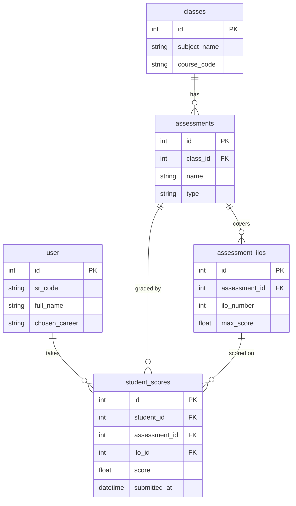

# Database Pipeline — End-to-End

How data flows through the ASPIRE database when a student runs an AI career report — from the trigger request to the persisted report and read-back.

---

## 1. High-Level Flow

```mermaid
flowchart LR
    subgraph CLIENT[Client]
        FE[Frontend]
    end

    subgraph API[FastAPI - pipeline_routes.py]
        R1[POST /pipeline/run/student_id]
        R2[GET  /pipeline/status/job_id]
        R3[GET  /pipeline/report/student_id]
    end

    subgraph WORKER[Background Worker - asyncio.to_thread]
        PS[pipeline_service.<br/>run_pipeline_job]
        CREW[ai/crew.<br/>build_and_run_crew]
        SCORE[ai/scoring.py<br/>deterministic rescore]
        GUARD[completeness +<br/>recommendation guards]
    end

    subgraph INPUT[(INPUT - read only)]
        T_USER[user]
        T_SCORE[student_scores]
        T_ASSESS[assessments]
        T_ILO[assessment_ilos]
        T_CLASS[classes]
        T_GH_PROF[github_profile]
        T_GH_REPO[repository_cache]
        T_GH_CONTRIB[contribution_cache]
    end

    subgraph STATE[(JOB STATE)]
        T_JOB[pipeline_jobs<br/>status, step, %]
    end

    subgraph CACHE[(DETERMINISM CACHES)]
        T_GH_CACHE[github_skill_cache]
        T_AC_CACHE[academic_skill_cache]
        T_EMB_CACHE[embedding_cache]
    end

    subgraph KB[(RAG KNOWLEDGE - pgvector)]
        T_KNOW[knowledge_chunks<br/>768-d embeddings]
    end

    subgraph OUTPUT[(OUTPUT)]
        T_REPORT[career_reports]
        T_ACT[activity feed]
        MD[artifacts/*.md]
    end

    FE -->|trigger| R1
    R1 -->|INSERT job| T_JOB
    R1 -->|spawn| PS

    PS -->|read| T_USER & T_SCORE & T_GH_PROF & T_GH_REPO & T_GH_CONTRIB
    PS -->|read latest for hash check| T_REPORT
    PS -->|UPDATE %| T_JOB
    PS --> CREW

    CREW -.hit?.- T_GH_CACHE
    CREW -.hit?.- T_AC_CACHE
    CREW -->|RAG cosine| T_KNOW
    CREW -.memoize.- T_EMB_CACHE
    CREW -->|UPSERT on success| T_GH_CACHE & T_AC_CACHE

    CREW --> SCORE --> GUARD
    GUARD -->|gap content| T_KNOW
    GUARD -->|INSERT| T_REPORT
    GUARD -->|emit| T_ACT
    GUARD -->|write file| MD
    GUARD -->|status=completed| T_JOB

    FE -.poll.-> R2 --> T_JOB
    FE -->|fetch| R3 --> T_REPORT

    style INPUT fill:#e3f2fd,stroke:#1976d2
    style STATE fill:#fff3cd,stroke:#856404
    style CACHE fill:#d1ecf1,stroke:#0c5460
    style KB fill:#f8d7da,stroke:#721c24
    style OUTPUT fill:#d4edda,stroke:#155724
    style WORKER fill:#e2e3e5,stroke:#383d41
```

---

## 2. Input Join — Where Academic Data Comes From

The pipeline reads grades via a 4-table join centred on `student_scores`. One score row = one student's answer to one ILO of one assessment in one class.



Each joined row is flattened to `{subject_name, course_code, assessment_name, ilo_number, max_score, score, percentage}` and handed to **Agent 2 (Academic Analyzer)**.

GitHub inputs (`github_profile`, `repository_cache`, `contribution_cache`) are scoped by `user_id` and feed **Agent 1 (GitHub Analyzer)**.

---

## 3. Table Reference

| Layer | Table | R/W | Purpose |
|---|---|:-:|---|
| **Input — student** | `user` | R | Profile, `sr_code`, `chosen_career` |
| **Input — academic** | `student_scores` ⨝ `assessments` ⨝ `assessment_ilos` ⨝ `classes` | R | ILO-level grades feeding Agent 2 |
| **Input — github** | `github_profile`, `repository_cache`, `contribution_cache` | R | OAuth-synced repos & commit stats feeding Agent 1 |
| **Job state** | `pipeline_jobs` | R/W | One row per run — `status`, `current_step`, `percentage`; polled by frontend |
| **Cache — Agent 1** | `github_skill_cache` | R/W | Keyed by SHA-256 of github block → hit skips Agent 1 |
| **Cache — Agent 2** | `academic_skill_cache` | R/W | Keyed by SHA-256 of `academic_scores` → hit skips Agent 2 |
| **Cache — RAG** | `embedding_cache` | R/W | Gemini embedding results keyed by query hash |
| **RAG knowledge** | `knowledge_chunks` (pgvector 768-d) | R | `career_path` / `ilo` / `curriculum` / `gap_closer` / `resources` |
| **Output — report** | `career_reports` | W | Full `report_json` blob + `summary` + `progression_json` + `chosen_career` snapshot |
| **Output — feed** | activity feed tables | W | `career_updated`, `skill_milestone` events |
| **Output — artifact** | filesystem markdown | W | Human-readable copy at `artifacts/student_career_reports/<name>.md` |

---

## 4. Run Sequence

```mermaid
sequenceDiagram
    autonumber
    actor U as Student
    participant API as FastAPI route
    participant DB as Postgres
    participant W as Worker thread
    participant LLM as CrewAI agents
    participant KB as knowledge_chunks (pgvector)

    U->>API: POST /pipeline/run/{id}
    API->>DB: INSERT pipeline_jobs (status=pending)
    API-->>U: 202 {job_id}
    API->>W: spawn run_pipeline_job

    W->>DB: SELECT user + scores + github
    W->>DB: SELECT latest career_reports (for hash check)
    W->>W: HMAC-SHA256(inputs)
    alt input_hash unchanged
        W->>DB: UPDATE pipeline_jobs status=completed
        Note over W,DB: short-circuit; no LLM cost
    else changed or force=true
        W->>DB: SELECT github_skill_cache / academic_skill_cache
        alt cache hit
            Note over W: skip Agent 1/2
        else miss
            W->>LLM: Agent 1 + Agent 2
            W->>DB: UPSERT *_skill_cache
        end
        W->>LLM: Agents 3-6 (skill fusion, career match, gaps, report)
        LLM->>KB: pgvector cosine queries
        LLM->>DB: read embedding_cache (memoize)
        W->>W: scoring.py deterministic rescore
        W->>DB: knowledge_chunks lookup (gap_closer / resources)
        W->>DB: INSERT career_reports
        W->>DB: emit activity events
        W->>W: write markdown artifact
        W->>DB: UPDATE pipeline_jobs status=completed, %=100
    end

    loop while running
        U->>API: GET /pipeline/status/{job_id}
        API->>DB: SELECT pipeline_jobs
        API-->>U: { status, %, step }
    end

    U->>API: GET /pipeline/report/{id}
    API->>DB: SELECT latest career_reports
    API-->>U: report_json
```

---

## 5. Key Properties

- **Determinism by hashing.** Three caches (`github_skill_cache`, `academic_skill_cache`, `embedding_cache`) plus an input-hash short-circuit on `career_reports._input_hash` mean repeated runs over unchanged data produce identical reports without any LLM cost.
- **HMAC, not plain SHA.** The input hash is HMAC-keyed with `SECRET_KEY` so a cached report from one deployment cannot be replayed against another.
- **Sync inside async.** CrewAI is blocking; the worker opens its own synchronous SQLAlchemy session (separate from the route's async session) and runs the crew via `asyncio.to_thread`.
- **Intermediate cache saves.** If the crew dies mid-run, completed agents persist their output to `*_skill_cache` before the exception propagates — the next retry skips work already done.
- **Completeness guard.** `_ensure_all_careers_present` queries `knowledge_chunks` and fills any career the LLM dropped with a deterministic fallback score so pinned UI cards never show blanks.
- **Orphan protection.** Jobs older than 10 minutes still in `pending`/`running` are auto-failed on the next `get_running_job` call (server-restart guard).
- **Audit-stable history.** Every report snapshots `chosen_career` and `progression_json` at write time, so Agent 7's diff against the previous report remains valid even if the student later changes their career pick.

---

## 6. What the Report Row Contains

`career_reports.report_json` is the full pipeline output, with the top-level keys:

| Key | Source | Contents |
|---|---|---|
| `summary` | Agent 6 | Executive summary paragraph |
| `skill_profile.unified_skills[]` | Agent 3 → Python fusion | Per skill: name, category, source, academic/github scores, fusion weights, final_score, status |
| `skill_profile.skill_summary` | Python | Counts per status band |
| `skill_profile.strongest_skills` / `weakest_skills` | Python | Top 3 / bottom 3 by final_score |
| `career_matches[]` | Agent 4 → Python rescore | Per career: title, match_score, matched_skills, gap_skills, reasoning, roadmap_url, career_recommendations |
| `recommendations` | Agent 6 | Top career & supporting rationale |
| `gap_analysis[]` | Agent 5 | Per gap: skill, priority, estimated_weeks, action plan, learning resources |
| `progress` | Agent 7 | readiness_score, readiness_change, trend, closed_gaps, new_skills_detected, motivational_insight |
| `_input_hash` | Worker | HMAC for the next-run short-circuit check |

Three companion columns sit beside the JSON blob for fast indexed access: `summary` (denormalised text), `progression_json` (Agent 7 only), and `chosen_career` (snapshot at write time).

---

## 7. Source References

- Route layer: [backend/app/api/pipeline_routes.py](../backend/app/api/pipeline_routes.py)
- Orchestrator: [backend/app/services/pipeline_service.py](../backend/app/services/pipeline_service.py)
- Crew assembly: [backend/app/ai/crew.py](../backend/app/ai/crew.py)
- Deterministic scoring: [backend/app/ai/scoring.py](../backend/app/ai/scoring.py)
- Models:
  - [backend/app/models/pipeline_models.py](../backend/app/models/pipeline_models.py) — `pipeline_jobs`, `career_reports`
  - [backend/app/models/user.py](../backend/app/models/user.py) — `user`
  - [backend/app/models/class_model.py](../backend/app/models/class_model.py) — `classes`, `assessments`, `assessment_ilos`, `student_scores`
  - [backend/app/models/github.py](../backend/app/models/github.py) — `github_profile`, `repository_cache`, `contribution_cache`
  - [backend/app/models/github_skill_cache.py](../backend/app/models/github_skill_cache.py)
  - [backend/app/models/academic_skill_cache.py](../backend/app/models/academic_skill_cache.py)
  - [backend/app/models/knowledge.py](../backend/app/models/knowledge.py) — `knowledge_chunks`, `embedding_cache`
